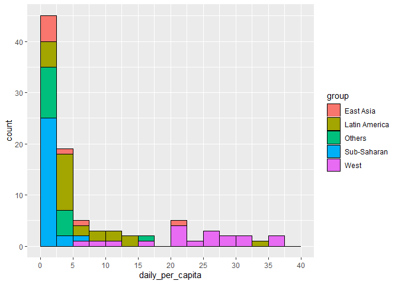
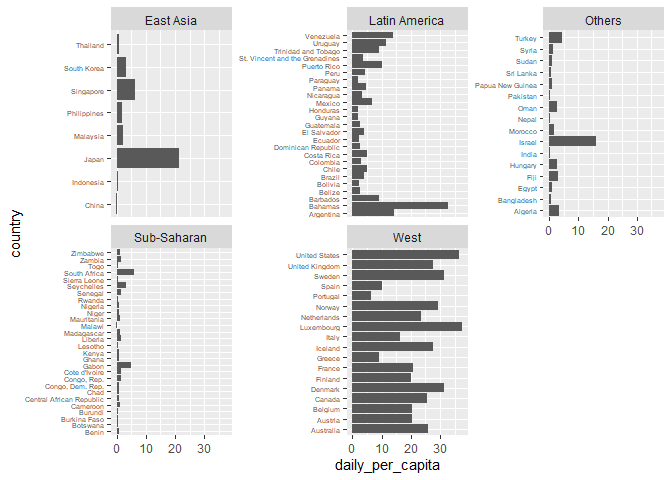

9 - Case study
================

- [1 Life spans and family sizes](#1-life-spans-and-family-sizes)
- [2 GDP](#2-gdp)
- [CONCLUSION (by me)](#conclusion-by-me)

In this chapter, we will be looking at the `gapminder` dataset from the
`dslabs` package.

We aim to use graphs to answer the following questions:

1.  For many years, the western world (Western Europe and North America)
    is characterized by long life spans and small families; whereas, the
    developing world (Africa, Asia, and Latin America) is characterized
    by short life spans and large families. Do the data support this
    view?

2.  Has wealth distribution across the world become worse over the
    years?

## 1 Life spans and family sizes

### a. Life expectancy v.s. fertility in 1960

We will start with looking at the the relationship between life
expectancy and fertility in 1960. Make an appropriate plot color-coded
by the continent.

``` r
gapminder |>
  filter(year == 1960) |>
  ggplot(aes(x = fertility, y = life_expectancy, label = country, color = continent)) + # label is a var so PUT IN AES
  geom_point( alpha=.2) + #transparency of text
  geom_text(size = 1, vjust =-1) # add countries name - need label 
```

<!-- -->

### b. 1960 -\> 1980 -\> 2010

In 1960, “the West versus developing world” view was grounded in some
reality. Is this still the case 20 years later? 50 years later?

Make a panel of plots that show the relationship between life expectancy
and fertility in 1960, 1980, and 2010. Separate the plot by both year
and continent.

``` r
gapminder |>
  filter(year %in% c(1960,1980,2010)) |>
  ggplot(aes(x = fertility, y = life_expectancy, color = continent)) +
  geom_point() +
  facet_grid(continent~year)
```

<!-- -->

### c. West v.s. Developing

Instead of comparing across 5 continents, we will create a variable
`group` as following to categorize “the West versus developing world”:

``` r
gapminder <- gapminder %>%
  mutate(group = case_when(
    region %in% c("Northern America", "Northern Europe", "Australia and New Zealand", "Western Europe","Southern Europe") ~ "West",
    region %in% c("Caribbean", "South America", "Central America") ~ "Latin America",
    region %in% c("Eastern Asia", "South-Eastern Asia") ~ "East Asia",
    continent == "Africa" & region != "Northern Africa" ~ "Sub-Saharan",
    .default = "Others"))
```

Make a panel of plots that show the relationship between life expectancy
and fertility in 1960, 1980, and 2010. Separate by both year and group.

``` r
gapminder |>
  filter(year %in% c(1960,1980,2010)) |>
  ggplot(aes(x = fertility, y = life_expectancy, color = group)) +
  geom_point() +
  facet_grid(group~year)
```

<!-- -->

## 2 GDP

The GDP measures the market value of goods and services produced by a
country in a year. The GDP per capita is often used as a rough summary
of a country’s wealth. The World Bank has a daily per capita
international poverty line (IPL), a global absolute minimum, of \$2.15 a
day as of September 2022.

First, create a variable called `daily_per_capita` that is taking the
country’s gpd divided by its’ population and then divided by 365 days.
Round to 2 decimals.

``` r
gapminder <- gapminder |> # ASSIGN to save
  mutate(daily_per_capita = round((gdp/population)/365,2)) 
```

### a. Daily_per_capita in 1960

Make a histogram to see the distribution of the daily_per_capita in
1960. Adjust the scale of the x-axis to be started from 0 with an
increment of 2.5.

``` r
gapminder |>
  filter(year == 1960 & !is.na(daily_per_capita)) |> # filter N/As
  ggplot(aes(x = daily_per_capita, fill = group)) +
  geom_histogram(breaks=seq(0,40,2.5), color = "black") +
  scale_x_continuous(breaks=seq(0,40,5))
```

<!-- -->

### b. Daily_per_capita in each country in 1960

The above histogram showed us that the 1960 income distribution values
show a dichotomy. However, the histogram does not show us if the two
groups of countries are west versus the developing world.

Make a panel of bar plots that show the daily_per_capita for each
country in each continent. Use `geom_vline(xintercept=20)` or
`geom_hline(yintercept=20)` to draw a reference line at
`daily_per_capita = 20`.

``` r
gapminder |>
  filter(year == 1960 & !is.na(daily_per_capita)) |> # filter N/As
  ggplot(aes(x=daily_per_capita, y=country)) +
  geom_col()+
  facet_wrap(~group, scales = "free_y") +
  theme(axis.text.y = element_text(size = 5))
```

<!-- -->

### c. Daily_per_capita in 1960 in each group

It is still a bit difficult to see the differences between Western and
Developing countries. Let’s quickly examine the daily_per_capita by the
group variable we created previously.

Make a panel of boxplots for daily_per_capita in 1960 in each group.
Reorder the boxplots by the median daily_per_capita.

``` r
gapminder |>
  filter(year == 1960 & !is.na(daily_per_capita)) |> # filter N/As
  ggplot(aes(x=daily_per_capita, y=reorder(group, daily_per_capita, median))) +
  geom_boxplot() +
  labs(y ="", title = "Daily_per_capita for each group")
```

<!-- -->

### d. Daily_per_capita from 1960 -\> 1980 -\> 2010 in each region

Make a panel of boxplots for daily_per_capita in 1960, 1980, and 2010.
Reorder the boxplots by the median daily_per_capita. Adjust the labels
and titles as you see fit. Color-code by group.

``` r
gapminder |>
  filter(year %in% c(1960, 1980, 2010) & !is.na(daily_per_capita)) |> # filter N/As
  ggplot(aes(x=daily_per_capita, y = reorder(group, daily_per_capita, median), fill = group)) +
  geom_boxplot() +
  facet_grid(year~.) +labs(title = "Daily_per_capita for each group across years",
    y = NULL)
```

<!-- -->

## CONCLUSION (by me)

1.  The data in 1c does support the inversely proportionate relationship
    between fertility rate and life expectancy: groups that moved toward
    lower birth rate over time witnessed longer life spans on average.
    However, what the data did not show is that the “developing world”
    were still living shorter lives and in “larger families” in 2010.
    Indeed, back in 1960, countries in the West were mostly aggregated
    in the low fertility - high lifespan region with only 2 outliers,
    while it was not the case for the rest of the world. In 2010, the
    trend seemed to be “less birth - more life” everywhere with
    countries Latin America and East Asia mostly concentrated in the low
    fertility - high lifespan region. <br> **Side comment:** The writer
    of the prompts seems to assume fertility indicates family size,
    which can be not entirely accurate.

2.  The global wealth gap DID become much wider from 1960 - 2010
    according to the stretched-over boxplots in 2d. Western and East Asian countries witnessed a significant contrast between poor and rich in 2010 with the 25th percentile being super far away from the 75th percentile.
