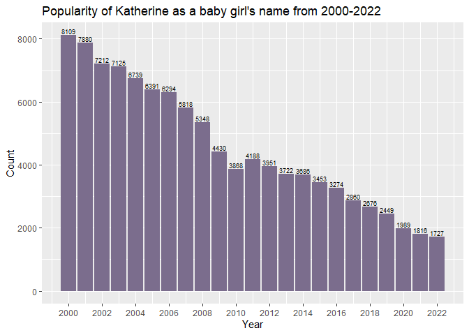
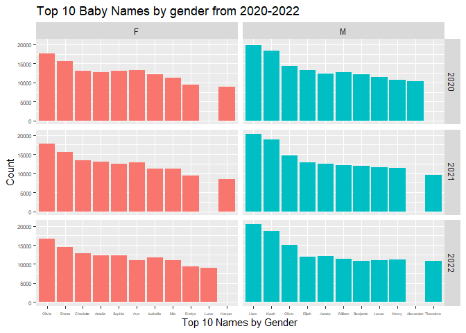

HW2
================
Kien Pham
2024-03-13

Revisit the names_by_birth_year dataset.

1.  Make a plot to show the use of Katherine as a girl name from 2000
    to 2022. Is the name Katherine getting more or less popular? You can
    also output the count to see if it matches what the graph shows.

``` r
names_by_birth_year |>
  filter(Name == "Katherine", Gender == "F", Year >= 2000 & Year <= 2022) |>
  arrange(Year) |>
  ggplot(aes(x = Year, y = Count)) +
  geom_col(fill = "#7b6d8d")+
  geom_text(aes(label = Count), vjust = -0.25, size = 2.5) +
  scale_x_continuous(breaks = seq(2000,2022,2)) +
  labs(x = "Year", title = "Popularity of Katherine as a baby girl's name from 2000-2022")
```

<!-- -->

Katherine has consistently shrinked in popularity as a girl’s name over
the span of 22 years (about 8 times less from 2000 to 2022)

2.  Make plots to show the top 10 baby boy names and top 10 baby girl
    names for each year from 2020 to 2022. Write a sentence or two to
    describe what the graphs show.

``` r
names_by_birth_year |>
  filter(Year >= 2020 & Year <= 2022) |>
  group_by(Gender, Year) |>
  slice_max(Count, n = 10) |>
  ggplot(aes(x = reorder(Name, -Count), y = Count, fill = Gender)) +
  geom_col() +
  facet_grid(Year~Gender, scales = "free_x") + theme(axis.text.x = element_text(size = 4),
    axis.text.y = element_text(size = 6), legend.position = "none") + 
  labs(x = "Top 10 Names by Gender", title = "Top 10 Baby Names by gender from 2020-2022")
```

<!-- -->

For baby girls, Olivia and Emma reigned the charts for 3 years as the
most common names. On the boys’ side, the consistent top 3 have been
Liam, Noah, and Oliver.
